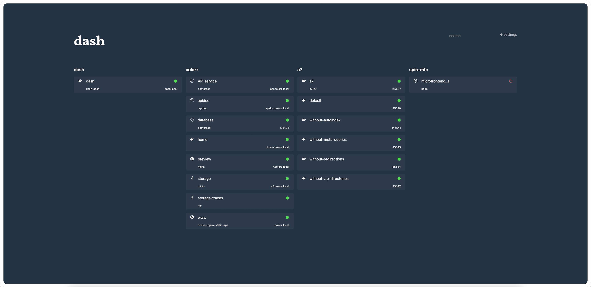

# Dash

`dash` is a drop-in minimalist Docker landing page with services auto-discovery.



## Features

- 🐳 **Automatic** Docker services discovery
- ⚡ Blazing-**fast**
- 🪶 **Extra light** Docker image (~7MB)
- 🛡️ **Robust** typed codebase
- 🟢 **Health check** compliant
- 👩‍🎨 **Integration** of 2k+ icons of tech stacks
- 🔍 **Search** services by name, image
- 🔄 **Responsive** user interface
- 💄 **Themable**
- 🔧 **Customizable**

## Getting started

### Global discovery

Run dash globally and discover services from all projects.

From the terminal:

```shell
docker run -it --rm -p 80:80 -v /var/run/docker.sock:/var/run/docker.sock codename/dash
```

Then go to <http://localhost>.

### Local discovery

Run dash for a dedicated project.

From the terminal:

```shell
docker run -it --rm -p 80:80 -v /var/run/docker.sock:/var/run/docker.sock -e PROJECT=myproject codename/dash
```

Then go to <http://localhost>.

From a compose file:

```yaml
services:
  dash:
    image: codename/dash
    ports:
      - 80:80
    volumes:
      - /var/run/docker.sock:/var/run/docker.sock:ro
    environment:
      PROJECT: myproject
```

```shell
docker compose up
```

Then go to <http://localhost>.

## Configuration

TBD.
