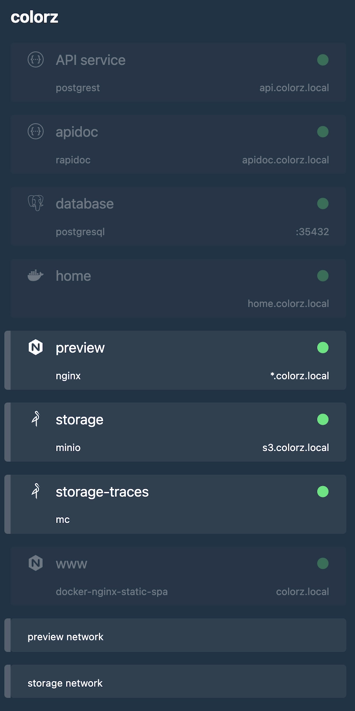
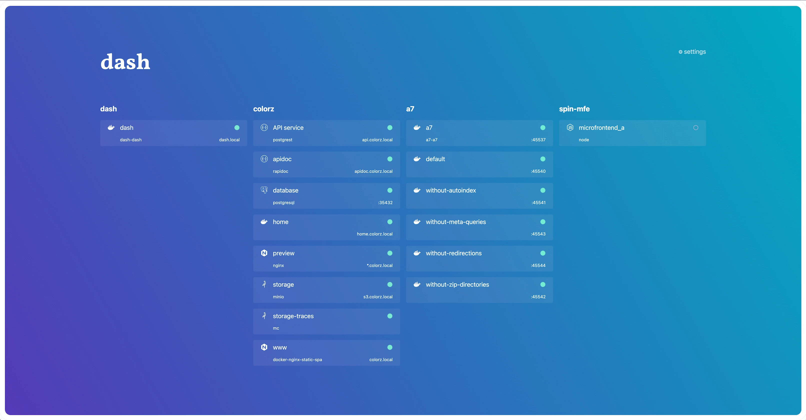
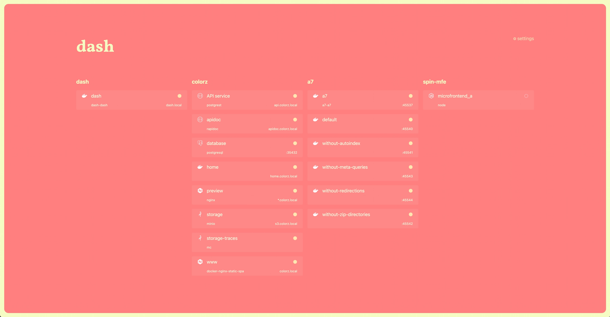
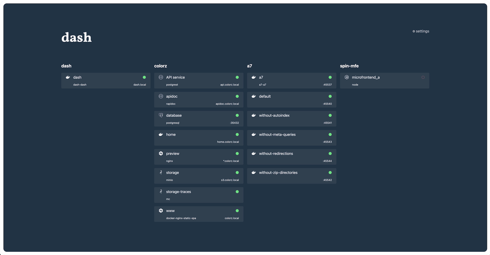
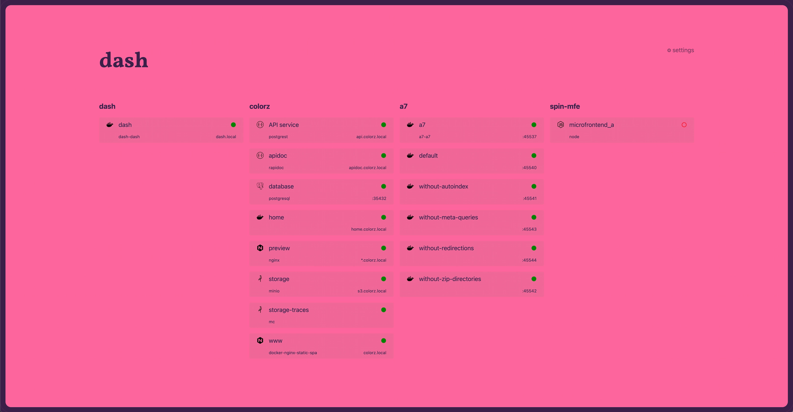
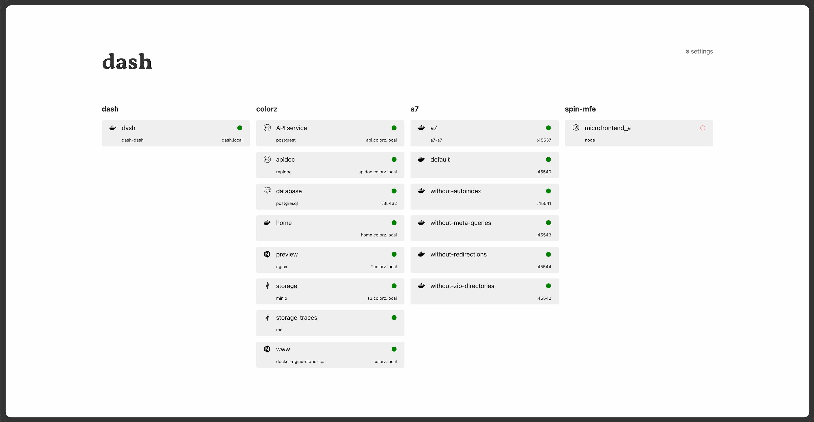
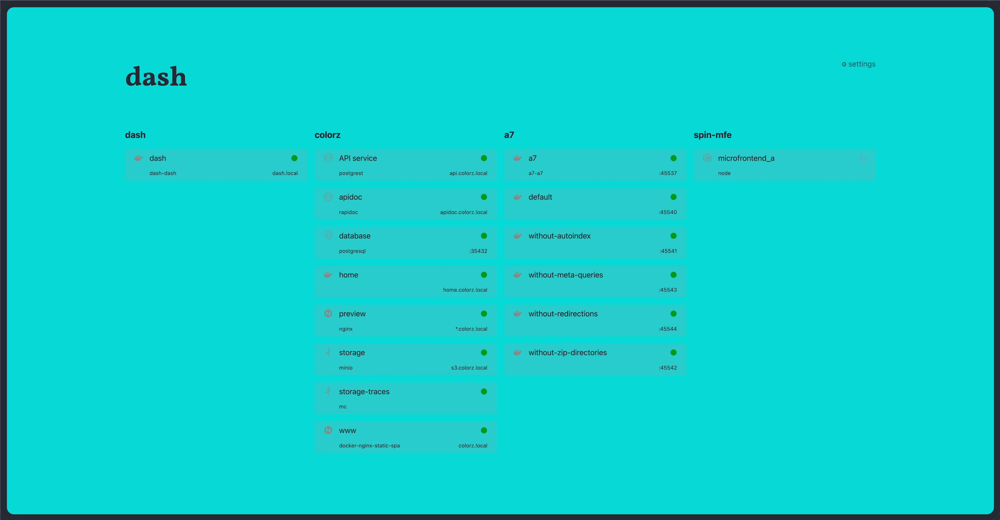
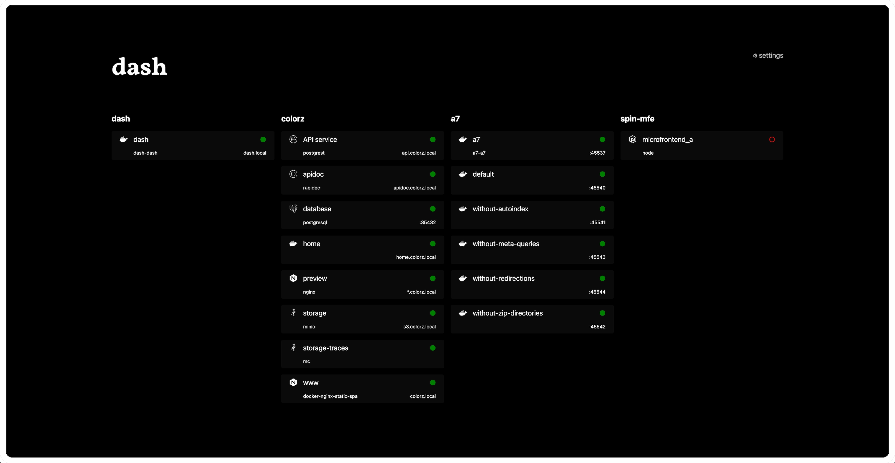

<center>

# Dash

Drop-in minimalist Docker landing page with services auto-discovery.


[https://img.shields.io/docker/pulls/codename/dash?style=for-the-badge](https://hub.docker.com/r/codename/dash)

</center>

## Features

- 🐳 **Automatic** Docker services discovery
- ⚡ **Blazing-fast** performances
- 🪶 **Extra light** Docker image (7MB)
- 🛡️ **Robust** typed codebase
- 🔄 **Responsive** user interface
- 🟢 **Health check** compliant [⬇](#health-checks)
- 🔍 **Search** services by name, image [⬇](#global-search)
- 🕵️‍♂️ **Identify** same-network services [⬇](#visualize-same-network-services)
- 💄 **Themable** [⬇](#theme)
- 🔧 **Customizable** [⬇](#configuration)

## Getting started

### Global discovery

```shell
docker run --rm -p 80:80 -v /var/run/docker.sock:/var/run/docker.sock \
  -it codename/dash
```

Then go to <http://localhost>.

### Local discovery

Run dash for a dedicated project.

```shell
docker run --rm -p 80:80 -v /var/run/docker.sock:/var/run/docker.sock \
  -e PROJECT=myproject \
  -it codename/dash
```

Then go to <http://localhost>.

## Advanced features

### Health checks

Todo.

### Global search

Searching for a specific container should be a breeze. Look it up by typing from anywhere in the page. The search engine can match both service names and image names.

### Visualize same-network services

While pressing the <kbd>Shift</kbd> key, hover a service to auto-detect its relations to other services relative to mutual networks they share:

<center>
  
</center>

## Configuration

### Environment variables

Environment variables are to be passed to the container starting context.

#### `PROJECT`

By default, dash displays all projects. Use the `PROJECT` environment variable to opt out of global discovery and restrict to a local discovery, limited to a single named project.

- Required: no
- Type: `string`
- Default: not defined

<details><summary>Example using <code>docker</code></summary>

```shell
docker run --rm -p 80:80 -v /var/run/docker.sock:/var/run/docker.sock \
  -e PROJECT=myproject \
  -it codename/dash
```

</details>

<details><summary>Example using <code>docker compose</code></summary>

```yaml
services:
  home:
    image: codename/dash
    ports:
      - 80:80
    volumes:
      - /var/run/docker.sock:/var/run/docker.sock:ro
    environment:
      PROJECT: myproject # 👈
```

</details>

#### `THEME`

Try alternative themes:

|  |  |  |  |  |  |  |
| -------------------------------------------------- | ------------------------------------------------ | -------------------------------------------- | ---------------------------------------------------- | ---------------------------------------------- | -------------------------------------------- | ------------------------------------------------------------ |

- Required: no
- Type: `dark`, `rainbow`, `light`, `colorful`, `highcontrast`, `pastel`, `neon`
- Default: `rainbow`

<details><summary>Example using <code>docker</code></summary>

```shell
docker run --rm -p 80:80 -v /var/run/docker.sock:/var/run/docker.sock \
  -e THEME=rainbow \
  -it codename/dash
```

</details>

<details><summary>Example using <code>docker compose</code></summary>

```yaml
services:
  home:
    image: codename/dash
    ports:
      - 80:80
    volumes:
      - /var/run/docker.sock:/var/run/docker.sock:ro
    environment:
      THEME: rainbow # 👈
```

</details>

#### `TITLE`

Override the displayed title.

- Required: no
- Type: `string`
- Default: `dash`

<details><summary>Example using <code>docker</code></summary>

```shell
docker run --rm -p 80:80 -v /var/run/docker.sock:/var/run/docker.sock \
  -e TITLE="my dashboard" \
  -it codename/dash
```

</details>

<details><summary>Example using <code>docker compose</code></summary>

```yaml
services:
  home:
    image: codename/dash
    ports:
      - 80:80
    volumes:
      - /var/run/docker.sock:/var/run/docker.sock:ro
    environment:
      TITLE: my dashboard # 👈
```

</details>

#### `UPDATE_INTERVAL`

By default, dash updates the data every second. This behavior can be altered using the `UPDATE_INTERVAL` environment variable.

- Required: no
- Type: `integer`
- Default: `1000` (in milliseconds)

<details><summary>Example using <code>docker</code></summary>

```shell
docker run --rm -p 80:80 -v /var/run/docker.sock:/var/run/docker.sock \
  -e UPDATE_INTERVAL=5000 \
  -it codename/dash
```

</details>

<details><summary>Example using <code>docker compose</code></summary>

```yaml
services:
  home:
    image: codename/dash
    ports:
      - 80:80
    volumes:
      - /var/run/docker.sock:/var/run/docker.sock:ro
    environment:
      UPDATE_INTERVAL: 5000 # 👈
```

</details>

### Labels

Labels are to be passed to specific containers that need tweaking.

#### `dash.enabled`

Dash displays services by default. Unwanted services can be withdrawn.

- Required: no
- Type: `boolean`
- Default: `true`

#### `dash.desc`

Display a short description next to a service.

- Required: no
- Type: `string`
- Default: not defined

#### `dash.icon`

Dash auto-guesses from the image name the best matching icon from 2,700+ references of popular brands and services.

Sometimes we prefer tempting fate and secure a special icon for a special service.

- Required: no
- Type: `string` that references a [simple icon](https://simpleicons.org/)
- Default: `docker`

#### `dash.name`

Dash displays the name of the service. This behavior can be overriden with a custom display label.

- Required: no
- Type: `string`
- Default: name of the service

#### `dash.url`

Dash auto-guesses the URL of the service, and is compatible with both [OrbStack](https://docs.orbstack.dev/docker/domains)'s container domain names and the more generic remote ports.

- Required: no
- Type: `string`
- Default: external URL of the service

## Alternatives

Looking for a different landing page? The community has got you covered with
[Dashy](https://github.com/Lissy93/dashy),
[Flame](https://github.com/pawelmalak/flame),
[Heimdall](https://github.com/linuxserver/Heimdall),
[Homarr](https://github.com/ajnart/homarr),
[Homer](https://github.com/bastienwirtz/homer),
[Homepage](https://github.com/gethomepage/homepage),
or [Organizr](https://github.com/causefx/Organizr).
